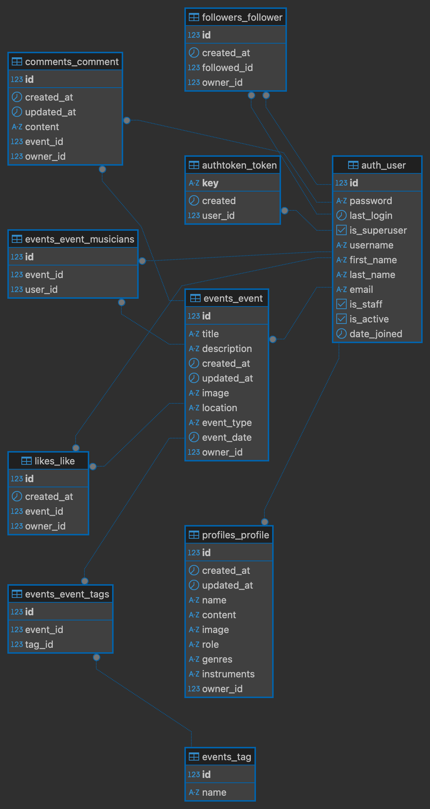
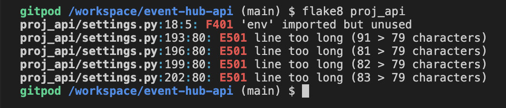
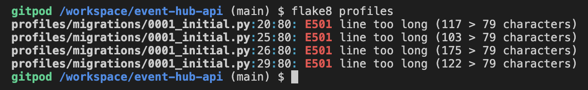
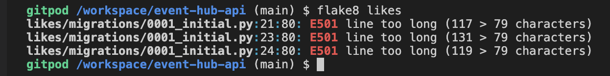
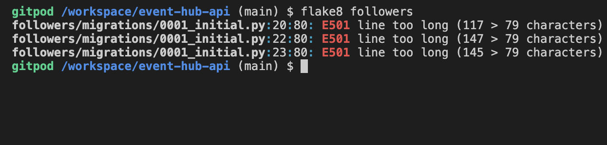
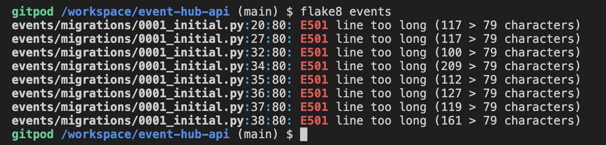
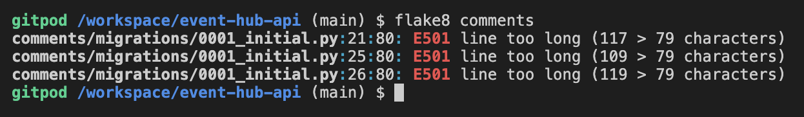
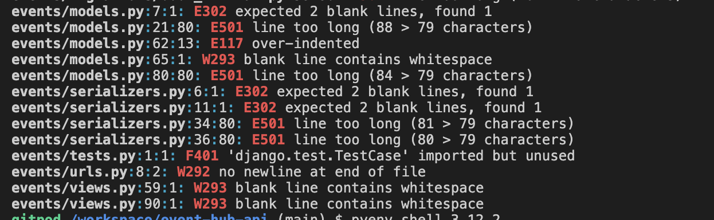

# Event Hub

Event Hub API is the backend service used by the [Event Hub Application](https://github.com/NoahDR17/event-hub-frontend).

## Development Goals

The primary objective of this API is to serve as the backend service for the Event Hub frontend application. It enables seamless **Create, Read, Update, and Delete (CRUD)** operations through the user interface, ensuring efficient management of events, profiles, and interactions within the platform.

### Agile

## Agile Planning

This project was developed using **agile methodologies**, delivering small, incremental features across three sprints/iterations over three weeks.

### Out of Scope Features/Tasks

During the development of this project, I cut several features due to time constraints and overall prioritization of core functionalities. These features included:

#### 1. Likes Feature
- Initially planned to enhance user engagement, the **Likes feature** was deprioritized in favor of completing other critical features.  
- I decided that the feature, while useful, closely resembled functionality from a previous walkthrough project, diminishing its uniqueness and priority in this specific application.  
- The focus was shifted towards implementing features that offered more distinctive value to the **Event Hub**, ensuring that the project delivered additional functionality beyond what was covered in tutorials/walkthroughs.  

#### 2. Tags Feature
- The **Tags feature** aimed to allow users to categorize events with customizable keywords, enhancing discoverability and organization.  
- However, during development, it became evident to me that the feature was alot more complicated and would require substantially. more time for proper integration with the **Event App** than i had originally planned.
- Given the time constraints, the decision was made to allocate resources to more impactful features, such as enhancing user profiles and developing the comments and follow functionalities, which were deemed more critical for fostering user interaction and community building within the platform.  

These decisions reflect a strategic approach to feature prioritization, focusing on delivering a functional and engaging **Minimum Viable Product (MVP)** within the allotted timeframe. The cut features remain potential candidates for future iterations of the project, should additional development time become available.

### Sprint Structure & Prioritization

All user stories were grouped into **epics**:

-  **Must have** – Core features, completed first to ensure a functional MVP.

-  **Should have** – Important but non-essential features, completed after the core.

-  **Could have** – Nice-to-have features, implemented if time allowed.

This prioritization ensured that all critical requirements were met first, providing a complete and usable product while allowing for additional improvements if capacity permitted.


### Kanban Board & Project Tracking

A **Kanban board** was created using **GitHub Projects**, which can be viewed [here](https://github.com/users/NoahDR17/projects/10/views/1).

### Epics

## Epic 1: API - Set Up

## Epic 2: API - Profiles App

## Epic 3: API - Event App

## Epic 4: API - Create Comments, Likes, and Followers/Following Features

## Epic 5: API - Event and Profile Feature Improvement

### User Stories and Their Epics

## Epic 1: API - Set Up

-  **1.1** Project Set Up

-  **1.2** Cloudinary

## Epic 2: API - Profiles App

-  **2.4:** Create Profile View

-  **2.3:** Create Profile Serializer

-  **2.2:** Create Profile Model

-  **2.1:** Create "Profiles" App
- 
## Epic 3: API - Event App

-  **3.7:** Event View and Serializer

-  **3.6:** Basic CRUD and Permissions Integration

-  **3.5:** Location & Event Type

-  **3.4:** Integrate Many-to-Many Tags

-  **3.3:** Event Model

-  **3.2:** Tag Model

-  **3.1:** Create "Events" App

## Epic 4: API - Create Comments, Likes, and Followers/Following Features

-  **4.4:** API - Update Events and Profiles to Display Followers/Followed, Likes, and Comments

-  **4.3:** Create Follow Feature

-  **4.2:** API - Likes Feature

-  **4.1:** Comments Feature

## Epic 5: API - Event and Profile Feature Improvement

-  **5.5:** Upgrade Basic Account Feature

-  **5.5:** Add More Musician Specific Fields to Profile Model

-  **5.4:** Musician Details

-  **5.3:** List Musicians Playing at Event

-  **5.2:** Create Event Organiser Only Access

-  **5.1:** Profile Update
### DataBase Design 

## Security

### Environment Variables Management

Environment variables were managed securely to prevent sensitive information from being exposed in the codebase:

-  **Local Development**: Environment variables (such as secret keys, and database credentials) were stored in an `env.py` file. This file was kept out of version control to ensure that sensitive data was not added to the repository.

-  **Production**: For the production environment, these variables were securely added to the Heroku Config Vars. This setup allows the application to access necessary configurations without exposing sensitive information.

-  **CORS Configuration** – Restricts API access to trusted origins.

### Permissions & Access Control

The API implements a **permissions class** to ensure secure access control based on user roles and authentication. This class enforces different levels of access depending on the user's authentication status and role within the system.

  
### Authentication & Authorization

To protect sensitive endpoints, the API uses:

-  **JWT Authentication** – Secure token-based authentication for user sessions.

-  **Role-Based Access Control (RBAC)** – Restricts actions based on user roles.

-  **Custom Permissions** – Control over who can create, read, update, or delete specific resources.

## Technologies

* Django

* Main framework used for application creation

* Django REST Framework

* Framework used for creating API

* Cloudinary

* Used for image hosting

* Heroku

* Used for hosting the application

* Git

* Used for version control

* Github

* Repository for storing code and docs

---

## Packages and Dependencies


The following dependencies are used for this project:
 
### Core Frameworks & Libraries

-  **Django** – `Django==5.1.4` (High-level web framework for rapid development)

-  **Django REST Framework (DRF)** – `djangorestframework==3.15.2` (API framework for building RESTful services)

### Authentication & Security

-  **dj-rest-auth** – `dj-rest-auth==7.0.1` (Authentication and authorization package)

-  **django-allauth** – `django-allauth==65.3.1` (User authentication, registration, and social authentication)

-  **django-rest-auth** – `django-rest-auth==0.9.5` (Older auth package for DRF)

-  **djangorestframework_simplejwt** – `djangorestframework_simplejwt==5.4.0` (JWT authentication)

-  **oauthlib** – `oauthlib==3.2.2` (OAuth authentication support)

-  **PyJWT** – `PyJWT==2.10.1` (JSON Web Token implementation)

-  **requests-oauthlib** – `requests-oauthlib==2.0.0` (OAuth 1 & 2 authentication for API requests)

-  **python3-openid** – `python3-openid==3.2.0` (OpenID authentication)


### Database & Storage

-  **dj-database-url** – `dj-database-url==0.5.0` (Database URL configuration)

-  **psycopg2** – `psycopg2==2.9.10` (PostgreSQL database adapter)

-  **sqlparse** – `sqlparse==0.5.3` (SQL parsing library for Django)


### Media & File Storage

-  **Cloudinary** – `cloudinary==1.42.1` (Cloud-based image and video storage)

-  **django-cloudinary-storage** – `django-cloudinary-storage==0.3.0` (Cloudinary integration for Django)

-  **Pillow** – `Pillow==8.2.0` (Image processing library)

### Middleware & Performance

-  **django-cors-headers** – `django-cors-headers==4.6.0` (CORS middleware for handling cross-origin requests)

-  **django-filter** – `django-filter==24.3` (Filtering support for Django REST Framework)

-  **asgiref** – `asgiref==3.8.1` (ASGI compatibility layer for Django)

-  **gunicorn** – `gunicorn==23.0.0` (WSGI HTTP server for production)

-  **pytz** – `pytz==2024.2` (Timezone support for Django)

These dependencies are managed via `pip` and can be installed using:

```bash

pip install  -r  requirements.txt

```

## Testing

### Tests During Development

- Test Case 1 (Carried out during the initial stages of backend development/profile-setup):

- Verify Default Cloudinay Image.

- Ensure that when no custom image is uploaded on profile creation, the application correctly assigns and displays a default image hosted on Cloudinary.

- Steps:

- Create Superuser, if one is already created then that one will work fine.

- In the devepment server, navigate to "profile/" or "profile/{id}".

- Check the image url of a profile.

- Ensure url is "https://res.cloudinary.com/<cloud-name>/image/upload/v1/media/../name-of-image"

- Expected Outcome:

- The url is "https://res.cloudinary.com/<cloud-name>/image/upload/v1/media/../name-of-image"

- Actual Outcome:

- The url is "/name-of-image"

- Fix:

- From what i gathered while troubleshooting the old method of declaring the default media file storage has been depracated.

- it is no longer " DEFAULT_FILE_STORAGE = 'cloudinary_storage.storage.MediaCloudinaryStorage' ", and instead is

" STORAGES = {

"staticfiles": {"BACKEND": "django.contrib.staticfiles.storage.StaticFilesStorage"},

"default": {"BACKEND": "cloudinary_storage.storage.MediaCloudinaryStorage"},

} "

- After making this change, image urls are what they were expected to be.

- more tests can be carried out once more functionality has been implemented.  

### Tests During Deployment

when deploying to heroku, first deployment failed, saying no python version specified, after adding a runtime file, and specifying an advised python version i redeployed succusfully,

but with warnings about using an unsecure python version.

fix 1: use a more up to date python version.

## Manual Tests
### Manual Test: Ensure Users Cannot Edit Another User's Profile
#### Test Objective

Verify that a logged-in or logged-out user cannot edit another user's profile information.
---

## Test Steps

1.  **Log in as `User A`:**

- Navigate to the login form.

- Enter `User A`'s credentials (username and password).

- Click the **Login** button.


2.  **Attempt to Edit `User B`'s Profile:**

- Locate `User B`'s profile detail page eg = "/profiles/UserB_Id".  

3.  **Perform Editing Action:**

- If an edit form appears, make changes to `User B`'s profile.

- Click **Save** or **Submit** to attempt saving the changes.

---

### Expected Result

-  `User A` is **not** able to access the edit form for `User B`'s profile.

- If `User A` attempts to submit changes directly (e.g., via URL manipulation):

-  `User B`'s profile remains unchanged.

#### Actual Result: When signed in as user A, i opened user B's ProfileDetail Page, and an edit form appeared, after editing the content of the profile, i submitted and the change was made.


#### Fix: added permission classes to "profiles/views.py" file, and added logic to validate the object permissions before a get request can be sent.

## Backend Test Cases for Event Hub

Each test case follows this structure:


-  **Test ID:** Unique identifier for the test.

-  **Description:** The purpose of the test.

-  **Steps:** Step-by-step instructions to perform the test.

-  **Expected Result:** What should happen if the feature works correctly.

-  **Actual Result:** The outcome of the test.

-  **Pass/Fail Status:** ✅ ❌

---

## Authentication & Authorization

### Test Case 1: User Registration

-  **Test ID:** AUTH-001

-  **Description:** Ensure a new user can register with valid credentials.

-  **Steps:**

1. Attempt to create a new account with valid credentials.

2. Verify the user is stored in the database.

-  **Expected Result:** A new user account is created and stored.

-  **Actual Result:** A new user account is created and stored.

-  **Pass/Fail Status:** ✅

---

### Test Case 2: User Login

-  **Test ID:** AUTH-002

-  **Description:** Validate that a registered user can log in with correct credentials.

-  **Steps:**

1. Attempt to log in with correct registered user credentials.

-  **Expected Result:** User is logged in.

-  **Actual Result:** User is logged in.

-  **Pass/Fail Status:** ✅


---


### Test Case 3: Prevent Unauthorized Profile Editing

-  **Test ID:** PROF-001

-  **Description:** Ensure users cannot update another user’s profile.

-  **Steps:**

1. Log in as `User A`.

2. Attempt to update `User B`'s profile.

-  **Expected Result:**  `User A` is unable to update `User B`'s profile.

-  **Actual Result:**  `User A` is unable to update `User B`'s profile.

-  **Pass/Fail Status:** ✅

---

## Event Management

### Test Case 4: Create Event

-  **Test ID:** EVENT-001

-  **Description:** Verify that organisers can create an event.

-  **Steps:**

1. Log in as organiser.

2. Attempt to create an event.

-  **Expected Result:** Event is created successfully and stored in the database.

-  **Actual Result:** Event is created successfully and stored in the database.

-  **Pass/Fail Status:** ✅

---

### Test Case 5: Retrieve Single Event

-  **Test ID:** EVENT-002

-  **Description:** Ensure users can fetch event details by ID.

-  **Steps:**

1. Send a GET request to `/events/{event_id}/`.

-  **Expected Result:** Event details are retrieved correctly.

-  **Actual Result:** Event details are retrieved correctly.

-  **Pass/Fail Status:** ✅

---

## Social Features (Comments, Followers)

### Test Case 6: Add Comment to Event

-  **Test ID:** SOCIAL-001

-  **Description:** Ensure users can add comments to an event.

-  **Steps:**

1. Log in.

2. Send a POST request to `/comments/` with comment text.

-  **Expected Result:** Comment is saved and linked to the event.

-  **Actual Result:** Comment is saved and linked to the event.

-  **Pass/Fail Status:**✅

---

##Note - additional backend testing, performed in front end to ensure it works: 
- In addition to above manual test cases, testing was also done incrementally throughout the development process, followed by a more extensive testing in the front-end application via the real API. This approach ensured not only functionality validation but also allowed me to observe live updates of data reflected in the API-driven front-end fields. Results can be found here [Frontend](https://github.com/NoahDR17/event-hub-frontend)

---
### Validator Results:
- All folders where run through **flake8**, all issues returned where fixed, other than lines too long in migration files, and the Auth Password Validators in settings.py as these are auto generated.
- Issues returned:
   - Whitespace
   - Line to long.
   - No new line at end of file.
   - Blank spaces
   - Over/Under indentation
   - Expected x blank
-  A Warning was returned in settings.py for env.py being imported but unused, since the env.py file is being used in development, this issue was ignored.

- **Project Validated**:


- **Profiles Validated**:


- **Likes Validated**:


- **Followers Validated**:


- **Events Validated**:


- **Comments Validated**:


-Here is an Example of what I was returned after running the flake8 test on a folder:


-  **Git**: Used to track code changes, commit, and push code during development.

-  **GitHub**: The source code is hosted on GitHub, allowing for version control and collaborative development.  

# Deployment

### Version Control


The **Event Hub Backend** project was developed using **Gitpod** as the IDE, with Git for version control, and the code was stored in a remote GitHub repository.


Throughout development, the following Git commands were used to manage and push code updates:
-  **`git add <file>`**

Adds the specified file(s) to the staging area, preparing them for a commit.

-  **`git commit -m "commit message"`**

Commits the changes in the staging area to the local repository with a descriptive message.

-  **`git push`**

Pushes all committed changes from the local repository to the remote repository on GitHub.

### Heroku Deployment

The **Event Hub Backend** site was deployed to Heroku, a cloud platform that allows easy deployment and scaling of web applications. Follow these steps to deploy the project on Heroku:

1.  **Set Up Heroku**

- Go to [Heroku](https://www.heroku.com/) and create an account (or log in if you already have one).

- In your Heroku dashboard, click the **New** button in the top right corner and select **Create New App**.

- Choose an **App Name** (it must be unique across Heroku) and select the appropriate **Region** based on your location.

- Click **Create App**.


2.  **Configure Environment Variables**

- Go to the **Settings** tab and click **Reveal Config Vars** to add necessary environment variables.

- Add the following config vars:

-  `SECRET_KEY`: The Django project's secret key.

-  `DATABASE_URL`: This should already exist.

-  `CLOUDINARY_URL`

-  `ALLOWED_HOST`

-  `CLIENT_ORIGIN:`: Url for the client front end react application that wil be making requests to these APIs

- Save each config var after entering.

3.  **Deploy with GitHub Integration**

- Go to the **Deploy** tab and scroll down to **Deployment method**.

- Under **Connect to GitHub**, click **Connect** and authorize Heroku to access your GitHub account if prompted.

- In the search box, find the repository you want to deploy, then click **Connect** to link it to Heroku.

4.  **Deploy the Application**

- In the **Manual deploy** section, select the **main** branch and click **Deploy Branch**.

- Heroku will begin building and deploying your app. Once completed, a message should confirm that the app was successfully deployed.

- Click **View** to open your live site.

To run the **Event Hub Backend** project on your local machine, follow these steps:

1.  **Clone the Repository**

- Go to the GitHub repository you wish to clone.

- Click on the **Code** dropdown button and select **HTTPS**.

- Copy the repository link provided.

2.  **Clone the Project Locally**

- Open your IDE or terminal of choice (ensure **Git** is installed on your machine).

- In the terminal, type the following command, replacing `copied-git-url` with the URL you copied:

```bash
git clone copied-git-url
```
- Press **Enter** to clone the project. The repository will now be downloaded to your local machine.

3.  **Set Up Environment Variables**
4. 
- Within the project directory, create a `.env` file to store your environment variables.
- Add the necessary keys, such as `SECRET_KEY`, `DATABASE_URL`. `CLOUDINARY_URL`.


4.  **Install Dependencies**

- Navigate into the project directory and install the required dependencies by running:
```bash
pip install -r requirements.txt
```

5.  **Apply Migrations**
- Run the following command to set up the database:

```bash
python manage.py migrate
```

6.  **Run the Server**

- Start the Django development server:

```bash
python manage.py runserver
```

- Open your browser and go to `http://127.0.0.1:8000` to view the application locally.
  
The project is now ready to be used on your local machine for development and testing.

### Fork Project
 

Forking a project allows you to create your own copy of someone else’s repository, making it easy to propose changes, experiment, or use it as a foundation for a new project.

To fork the **Recipe Blog** repository:

1.  **Navigate to the Repository**

- Go to the GitHub repository page that you want to fork.

2.  **Create the Fork**

- In the top right corner of the page, click the **Fork** button.

- GitHub will create a copy of the full project in your own GitHub account.


3.  **Modify and Experiment**

- You now have a duplicate of the original project under your account. You can make changes to your forked copy without affecting the original repository.

- If you wish to propose changes to the original project, you can submit a **pull request** from your forked repository.

This process also allows you to test changes before pushing it to the main/master branch.

## Credits

- **Dbeaver**: Referenced [Dbeaver](https://dbeaver.io/) to connect to my database, and create ERD.
